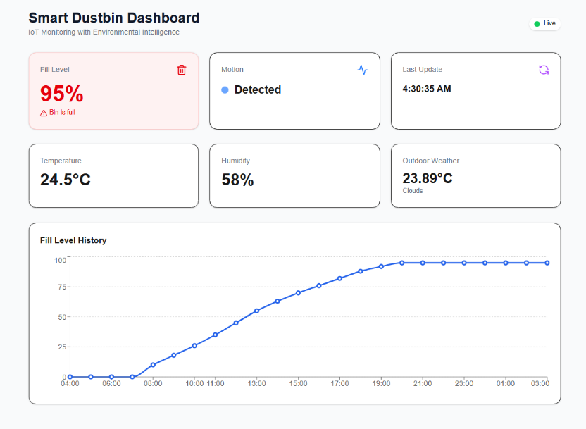
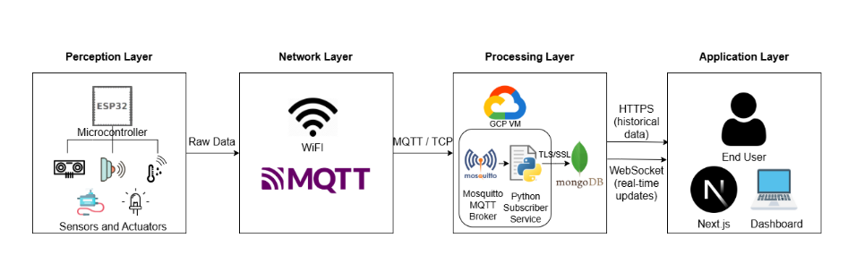

# 🗑️ Smart Dustbin IoT System

A comprehensive IoT solution for automated waste management and environmental monitoring. This system integrates an **ESP32** microcontroller with **Google Cloud Platform (GCP)**, **MongoDB Atlas**, and a **Next.js** dashboard to provide real-time telemetry and control.



## 🚀 Features

* **Real-Time Fill Monitoring:** Ultrasonic sensor measures waste levels in real-time.
* **Touchless Operation:** IR sensor detects motion to automatically open the lid (Servo Motor).
* **Environmental Sensing:** DHT22 sensor monitors internal temperature and humidity.
* **Visual Feedback:** LED indicators (Green/Red) on the bin for immediate status.
* **Cloud Integration:** Data is transmitted via MQTT to a Google Cloud VM.
* **Data Persistence:** Historical logs are stored securely in MongoDB Atlas (NoSQL).
* **Live Dashboard:** A modern, responsive Next.js web interface to visualize metrics.

## 🛠️ System Architecture




The project follows a 4-layer IoT architecture:
1.  **Perception Layer:** ESP32, Ultrasonic, IR, DHT22, Servo, LEDs.
2.  **Network Layer:** MQTT Protocol over Wi-Fi.
3.  **Processing Layer:** GCP Compute Engine (Mosquitto Broker + Python Bridge).
4.  **Application Layer:** Next.js Dashboard + MongoDB Atlas.

---

## 📂 Repository Structure

```bash
├── # Next.js Frontend Application
├── arduino_code/    # Arduino/ESP32 Firmware (.ino)
├── python_Script/   # Python Bridge Script & Requirements
└── README.md        # Project Documentation
